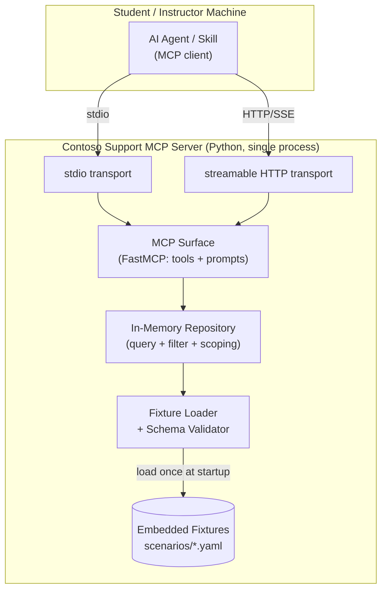
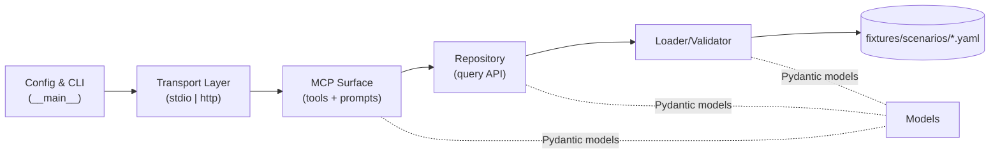
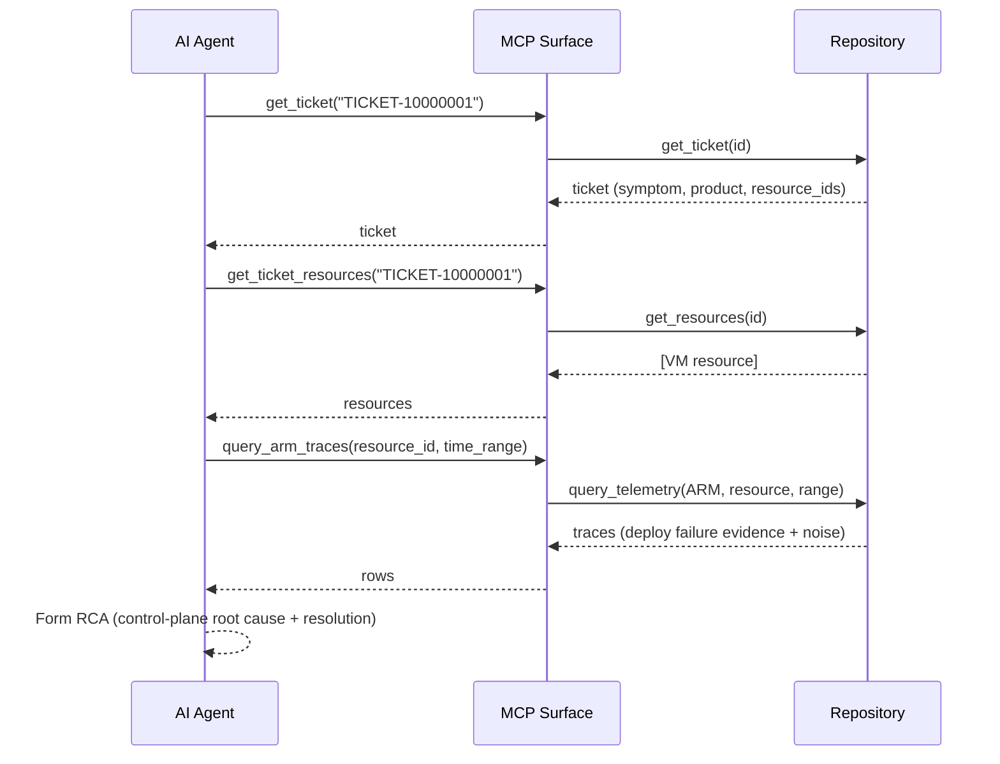

# Contoso Support Ticketing MCP Server Architecture Document

## Introduction

This document outlines the overall project architecture for the **Contoso Support Ticketing MCP Server**, including backend systems, the mock data layer, and non-UI concerns. Its primary goal is to serve as the guiding architectural blueprint for AI-driven development, ensuring consistency and adherence to chosen patterns and technologies.

**Relationship to Frontend Architecture:** N/A. This is a headless MCP server with no user interface. Students connect their own AI agents/Skills via the MCP protocol.

### Starter Template or Existing Project

**N/A — greenfield.** No starter template is used. The project is built from scratch on the official Python MCP SDK. The repository already exists (containing BMAD tooling and docs); application code will be added under `src/`. Manual setup of tooling and configuration is expected and documented in the Source Tree and Infrastructure sections.

### Change Log

| Date       | Version | Description                          | Author         |
|------------|---------|--------------------------------------|----------------|
| 2026-07-23 | 1.0     | Initial architecture from PRD        | Winston (Arch) |
| 2026-07-24 | 1.1     | Epic 5: KnownIssue model + search_known_issues tool; Workshop Integration assets section | Sarah (PO) |

## High Level Architecture

### Technical Summary

The Contoso Support Ticketing MCP Server is a **single-process, stateless Python monolith** exposing MCP **tools** and **prompts** over two interchangeable transports (**stdio** for offline student hosting, **streamable HTTP** for instructor hosting). It is built on the official Python MCP SDK (FastMCP) and reads a fully-embedded, deterministic mock dataset — support tickets and correlated Kusto-style telemetry — loaded from bundled fixture files into in-memory indices at startup. A clean seam separates the **MCP surface** (tool/prompt handlers) from the **mock data layer** (Pydantic models, a fixture loader/validator, and an in-memory repository with query logic). This directly supports the PRD goals: realistic Azure support-engineering scenarios, deterministic and repeatable responses for gradeable labs, zero external dependencies, and a scenario library that scales to 100+ without code changes.

### High Level Overview

1. **Architectural style:** Modular monolith — one Python process, internally layered (transport → MCP surface → service/repository → data fixtures). Chosen for simplicity, offline determinism, and easy classroom distribution (PRD: Monolith).
2. **Repository structure:** **Monorepo** (PRD) — server code, fixtures, prompts, tests, and docs in one distributable unit.
3. **Service architecture:** Single stateless service; responses are a pure function of (loaded fixtures + tool inputs), which is what guarantees determinism.
4. **Primary data flow:** A student's agent → (via MCP tool call) → MCP surface handler → repository query over in-memory indices → structured result. The canonical journey: read a ticket → pivot to its resource → query correlated Kusto telemetry → (iterate for multi-round scenarios) → produce an RCA.
5. **Key decisions & rationale:**
   - **FastMCP (Python MCP SDK)** gives both stdio and streamable HTTP from one implementation — satisfies the dual-transport requirement without a second codebase.
   - **In-memory, fixture-backed data** (no database) keeps the server offline, fast (<1s), and trivially concurrency-safe for classroom-scale reads.
   - **One YAML file per scenario** keeps scenarios self-contained, human-authorable, and addable without touching server code (PRD NFR9).
   - **Determinism by construction:** no randomness or wall-clock dependence at query time; any "realistic noise" is authored into fixtures.

### High Level Project Diagram



### Architectural and Design Patterns

- **Modular Monolith:** One process, layered internally (transport / MCP surface / service / data). - _Rationale:_ Matches PRD's monolith decision; simplest thing that satisfies offline determinism and classroom distribution.
- **Repository Pattern:** The data layer exposes a repository API (`get_ticket`, `search_tickets`, `get_resources`, `query_telemetry`) abstracting the in-memory indices. - _Rationale:_ Keeps the MCP surface thin, makes the data layer independently testable, and isolates the fixture format from tool code.
- **Data Transfer Objects via Pydantic:** All entities and tool I/O are Pydantic models. - _Rationale:_ Free validation of fixtures on load and of tool inputs at the boundary; auto-generated JSON schemas for MCP tool descriptions.
- **Loader/Validator on Startup (fail-fast):** Fixtures are parsed and validated once at boot; malformed data aborts startup with a precise error. - _Rationale:_ Guarantees classroom reliability — bad data can never reach a student mid-lab.
- **Pure-Function Query Layer:** Queries are deterministic filters over immutable in-memory data. - _Rationale:_ Delivers the determinism guarantee (identical inputs → identical outputs) and inherent read concurrency safety.
- **Data-Driven Scenarios:** Behavior/content lives in fixtures, not code. - _Rationale:_ Scales to 100+ scenarios and multi-round evidence chains without server changes (PRD NFR9, FR9/FR10).

## Tech Stack

### Cloud Infrastructure

- **Provider:** None. The server runs entirely locally (student laptop or instructor laptop). No cloud provider, credentials, or internet access are used at runtime (PRD NFR1).
- **Key Services:** N/A.
- **Deployment Regions:** N/A.

### Technology Stack Table

| Category | Technology | Version | Purpose | Rationale |
|---|---|---|---|---|
| **Language** | Python | 3.12.x | Primary implementation language | Modern, widely available; matches PRD; strong typing via type hints + Pydantic |
| **MCP Framework** | `mcp` (Python SDK, FastMCP) | ≥ 1.9, < 2.0 | MCP server, tools, prompts, transports | Official SDK; provides stdio **and** streamable HTTP from one codebase (confirm exact version at setup) |
| **Data Validation** | Pydantic | 2.x | Models, fixture validation, tool I/O schemas | Fail-fast fixture validation; auto JSON schema for MCP tool descriptions |
| **Fixture Format** | YAML (`PyYAML` or `ruamel.yaml`) | PyYAML 6.x | Human-authorable scenario files | Readable, diff-friendly, one file per scenario |
| **ASGI Server** | Uvicorn | 0.30.x | Host the streamable HTTP transport | Standard async server for the network mode (used by FastMCP HTTP app) |
| **Package/Env Manager** | uv | ≥ 0.4 | Dependency mgmt, venv, run | Fast, reproducible; single-command setup for the classroom |
| **Test Framework** | pytest | 8.x | Unit / integration / e2e tests | De facto standard; fixtures map well to scenario testing |
| **Async Test Support** | pytest-asyncio | 0.23.x | Test async MCP client/server flows | Needed for integration tests over transports |
| **Lint/Format** | Ruff | ≥ 0.5 | Linting + formatting | Fast, single tool; enforces consistency for AI + human devs |
| **Type Checking** | mypy (optional) | 1.x | Static type checks | Optional gate; complements Pydantic at boundaries |

> **Note:** MCP SDK and adjacent versions evolve quickly — pin exact versions in `pyproject.toml`/lockfile at project init and verify the SDK's current transport API. Everything above must run fully offline after initial dependency install.

## Data Models

The domain centers on a **Scenario** aggregate: a self-contained unit linking a ticket, its Azure resources, correlated telemetry, and the ground-truth root cause. One scenario = one authored YAML file.

### Scenario

**Purpose:** The top-level aggregate binding a support incident to its resources, telemetry evidence, and ground-truth root cause + investigation path. Enables end-to-end RCA and grading.

**Key Attributes:**
- scenario_id: str — Stable id (mirrors the ticket id, e.g., `TICKET-10000001`)
- difficulty: enum(`single_round`, `multi_round`) — Investigation depth classification
- root_cause: RootCause — Ground-truth cause + resolution/next-step
- investigation_path: list[InvestigationStep] — Intended query sequence (for multi-round scenarios; supports grading)

**Relationships:**
- Has one Ticket
- Has one or more AzureResource
- Has many TelemetryRecord (across the four tables), each tied to a resource

### Ticket

**Purpose:** The customer-reported incident an agent starts from.

**Key Attributes:**
- ticket_id: str — Format `TICKET-XXXXXXXX` (8 digits), unique
- title: str — Short summary
- symptom: str — Customer-reported problem statement
- azure_product: str — e.g., "Azure Virtual Machines", "Azure Virtual Machine Scale Sets", "Azure Networking"
- persona: enum(`windows_admin`, `azure_developer`) — Reporter type
- severity: enum(`Sev1`, `Sev2`, `Sev3`, `Sev4`)
- status: enum(`New`, `Active`, `Pending`, `Resolved`) — Read-only in MVP
- created_at / updated_at: datetime (ISO 8601)
- resource_ids: list[str] — References to affected resources

**Relationships:**
- Belongs to one Scenario
- References one or more AzureResource

### AzureResource

**Purpose:** The Azure resource whose telemetry the agent investigates; the pivot target from a ticket.

**Key Attributes:**
- resource_id: str — ARM resource id (`/subscriptions/{sub}/resourceGroups/{rg}/providers/Microsoft.Compute/virtualMachines/{name}`)
- resource_type: enum(`Microsoft.Compute/virtualMachines`, `Microsoft.Compute/virtualMachineScaleSets`, ...)
- name / resource_group / subscription_id: str
- location: str — e.g., "eastus"
- instances: list[str] — VMSS instance ids (empty for a plain VM)

**Relationships:**
- Belongs to one Scenario
- Referenced by a Ticket
- Has many TelemetryRecord

### TelemetryRecord (base) → ARM / Network / ComputeHost / ComputeGuest

**Purpose:** A single row in one of the mock Kusto tables, correlated to a resource (and, where relevant, a VMSS instance) and carrying the evidence for the scenario's root cause (plus realistic noise).

**Key Attributes (common):**
- table: enum(`ArmControlPlaneTraces`, `NetworkLogs`, `ComputeHostLogs`, `ComputeGuestLogs`)
- time_generated: datetime — Row timestamp (drives time-range scoping)
- resource_id: str — Owning resource
- (table-specific columns — see Database Schema)

**Relationships:**
- Belongs to one Scenario and one AzureResource

### RootCause & InvestigationStep

**Purpose:** Ground truth for grading. RootCause holds the cause category, explanation, and resolution/next-step. InvestigationStep documents which tool call + filters reveal which evidence, forming the intended path for multi-round scenarios.

**Key Attributes:**
- RootCause: category: enum(`arm`, `network`, `compute_host`, `compute_guest`), summary: str, resolution: str
- InvestigationStep: order: int, tool: str, params: dict, reveals: str

### KnownIssue (KB — Epic 5)

**Purpose:** A generic, curated Azure known-issue entry backing the `search_known_issues` tool. Deliberately **decoupled** from scenarios' `RootCause` so the KB never exposes the per-ticket grading answer — it offers general remediation guidance an agent can consult but must still confirm via telemetry.

**Key Attributes:**
- id: str (`KB-<DOMAIN>-###`), title: str, product: str, category: enum(same `RootCauseCategory`), symptom: str, remediation: str, doc_link: str | None

**Relationships:** Independent — lives in `fixtures/known_issues.yaml` (sibling of `scenarios/`, ignored by the scenario glob), loaded once at startup and held by the Repository.

## Components

### Transport Layer

**Responsibility:** Start the server in the selected mode and bridge MCP messages to the surface handlers.

**Key Interfaces:**
- `run_stdio()` — offline student mode
- `run_http(host, port)` — instructor-hosted streamable HTTP mode

**Dependencies:** MCP Surface, Config

**Technology Stack:** FastMCP transports; Uvicorn for HTTP.

### MCP Surface (Tools & Prompts)

**Responsibility:** Declare and handle MCP tools and prompts; validate inputs; translate repository results into tool outputs with clear schemas/descriptions.

**Key Interfaces:**
- Ticket tools: `get_ticket`, `list_tickets`, `search_tickets`
- Resource tool: `get_ticket_resources`
- Telemetry tools: `query_arm_traces`, `query_network_logs`, `query_compute_host_logs`, `query_compute_guest_logs`
- KB tool (Epic 5): `search_known_issues` (generic remediation; own module `tools/kb.py`)
- Health tool: `get_server_info`
- Prompts: triage/scoping, follow-up questioning, iterative investigation, RCA

**Dependencies:** Repository, Models

**Technology Stack:** FastMCP decorators; Pydantic models for I/O.

### Repository (In-Memory Data Access)

**Responsibility:** Provide deterministic query methods over the loaded, immutable in-memory indices (by ticket id, search index, resource-by-ticket, telemetry-by-(table, resource)).

**Key Interfaces:**
- `get_ticket(id)`, `search_tickets(filters, page)`, `list_tickets(page)`
- `get_resources(ticket_id)`, `get_resource(resource_id)`
- `query_telemetry(table, resource_id, time_range, filters, instance_id?)`
- `search_known_issues(query?, product?, category?)` (Epic 5; over the loaded KB list)

**Dependencies:** Loader (data), Models

**Technology Stack:** Pure Python; dict/list indices built once at startup.

### Fixture Loader & Validator

**Responsibility:** Discover, parse, and validate all scenario YAML files at startup; build indices; fail fast with precise errors on any schema violation or cross-reference inconsistency.

**Key Interfaces:**
- `load_scenarios(path) -> Dataset`
- `validate(dataset)` — schema + referential + evidence-consistency checks

**Dependencies:** Models, fixtures on disk

**Technology Stack:** PyYAML + Pydantic.

### Config & CLI

**Responsibility:** Parse CLI/env config (transport, host, port, fixtures path), apply defaults, and surface clear errors for invalid config.

**Key Interfaces:** `__main__.py` entry point; `Settings` model.

**Dependencies:** Transport Layer.

**Technology Stack:** argparse (or Typer) + Pydantic settings.

### Component Diagram



## External APIs

**None.** The server makes no external API calls and requires no credentials or internet access at runtime. All ticket and telemetry data is mocked and embedded (PRD NFR1, NFR2). This section is intentionally empty.

## Core Workflows

### Single-round RCA (e.g., ARM control-plane failure)



### Multi-round RCA (evidence distributed across tables)

```mermaid
sequenceDiagram
    participant A as AI Agent
    participant M as MCP Surface
    participant R as Repository
    A->>M: get_ticket + get_ticket_resources
    M-->>A: VMSS resource (instances)
    A->>M: query_compute_host_logs(resource, range)
    M-->>A: host logs (inconclusive: healthy host)
    A-->>A: Hypothesis: issue is in-guest, not host
    A->>M: query_compute_guest_logs(resource, instance_id, range)
    M-->>A: guest Windows events (service crash evidence)
    A-->>A: Refine RCA; confirm via narrowed query if needed
```

## Database Schema

There is **no database**. "Schema" here means the shape of (a) the scenario fixture file and (b) the four mock Kusto tables. All are loaded into memory from YAML. Columns approximate real Azure log schemas closely enough to be believable while remaining tractable to author.

### Scenario Fixture File (one per scenario)

```yaml
# fixtures/scenarios/TICKET-10000001.yaml
scenario_id: TICKET-10000001
difficulty: single_round          # or multi_round
ticket:
  ticket_id: TICKET-10000001
  title: "VM deployment fails with allocation error"
  symptom: "Customer cannot start VM 'prod-web-01'; portal shows an allocation failure."
  azure_product: "Azure Virtual Machines"
  persona: windows_admin
  severity: Sev2
  status: Active
  created_at: "2026-05-14T09:12:00Z"
  updated_at: "2026-05-14T09:40:00Z"
  resource_ids:
    - "/subscriptions/00000000-0000-0000-0000-000000000001/resourceGroups/rg-prod/providers/Microsoft.Compute/virtualMachines/prod-web-01"
resources:
  - resource_id: "/subscriptions/.../virtualMachines/prod-web-01"
    resource_type: "Microsoft.Compute/virtualMachines"
    name: "prod-web-01"
    resource_group: "rg-prod"
    subscription_id: "00000000-0000-0000-0000-000000000001"
    location: "eastus"
    instances: []
telemetry:
  arm_control_plane_traces:
    - time_generated: "2026-05-14T09:12:03Z"
      resource_id: "/subscriptions/.../virtualMachines/prod-web-01"
      correlation_id: "b1e2..."
      operation_name: "Microsoft.Compute/virtualMachines/write"
      caller: "admin@contoso.com"
      http_status_code: 409
      level: "Error"
      activity_status: "Failed"
      sub_status: "AllocationFailed"
      resource_group: "rg-prod"
      subscription_id: "00000000-0000-0000-0000-000000000001"
      client_ip: "13.68.x.x"
      properties: "SKU Standard_D4s_v5 not available in zone 1"
  network_logs: []
  compute_host_logs: []
  compute_guest_logs: []
root_cause:
  category: arm
  summary: "Capacity/allocation failure for the requested VM SKU in the target zone."
  resolution: "Retry in another zone or resize to an available SKU; request capacity if persistent."
investigation_path:
  - order: 1
    tool: query_arm_traces
    params: { time_range: "2026-05-14T09:00:00Z/2026-05-14T10:00:00Z" }
    reveals: "409 AllocationFailed on VM write operation."
```

### Table: ArmControlPlaneTraces

Approximates Azure Activity Log / ARM control-plane operations.

| Column | Type | Notes |
|---|---|---|
| time_generated | datetime | Row timestamp (UTC) |
| resource_id | string | ARM resource id |
| subscription_id | string | GUID |
| resource_group | string | |
| correlation_id | string | Correlates related operations |
| operation_name | string | e.g., `Microsoft.Compute/virtualMachines/write` |
| caller | string | User/principal |
| client_ip | string | |
| http_status_code | int | e.g., 200, 409, 503 |
| level | string | Informational / Warning / Error |
| activity_status | string | Started / Succeeded / Failed |
| sub_status | string | e.g., `AllocationFailed`, `Conflict` |
| properties | string | Free-form detail / error message |

### Table: NetworkLogs

Approximates NSG flow logs / Network Watcher.

| Column | Type | Notes |
|---|---|---|
| time_generated | datetime | |
| resource_id | string | NIC/NSG/VM resource id |
| subscription_id | string | |
| flow_direction | string | Inbound / Outbound |
| source_ip | string | |
| destination_ip | string | |
| source_port | int | |
| destination_port | int | |
| protocol | string | TCP / UDP / ICMP |
| action | string | Allow / Deny |
| nsg_rule_name | string | Matched rule |
| bytes_sent | int | |
| bytes_received | int | |
| packets_sent | int | |
| packets_received | int | |

### Table: ComputeHostLogs

Platform/host-layer events for VM and VMSS (Azure-side, not in-guest).

| Column | Type | Notes |
|---|---|---|
| time_generated | datetime | |
| resource_id | string | VM or VMSS resource id |
| subscription_id | string | |
| instance_id | string | VMSS instance (empty for plain VM) |
| host_node | string | Physical host identifier (opaque) |
| event_name | string | e.g., `LiveMigration`, `PlatformReboot`, `PlannedMaintenance`, `AllocationHealth`, `HostDegraded` |
| health_status | string | Healthy / Degraded / Unavailable |
| maintenance_type | string | None / Planned / Unplanned |
| level | string | Informational / Warning / Error |
| message | string | Free-form detail |

### Table: ComputeGuestLogs

In-guest **Windows** logs (Windows Event Log style) for VM and VMSS instances. Windows-only per MVP (PRD NFR7).

| Column | Type | Notes |
|---|---|---|
| time_generated | datetime | |
| resource_id | string | VM or VMSS resource id |
| subscription_id | string | |
| instance_id | string | VMSS instance (empty for plain VM) |
| computer | string | Guest hostname |
| channel | string | System / Application / Security |
| provider_name | string | Event source, e.g., `Service Control Manager` |
| event_id | int | Windows Event ID, e.g., 7031, 41, 1074 |
| level | string | Error / Warning / Information |
| task | string | Category |
| message | string | Event message |

## Source Tree

```plaintext
mock-mcp/
├── pyproject.toml                     # deps, entry point, tool config (uv/ruff/pytest)
├── uv.lock                            # pinned, reproducible deps
├── README.md                          # setup + run (both transport modes)
├── src/
│   └── contoso_support_mcp/
│       ├── __init__.py
│       ├── __main__.py                # CLI: transport/host/port/fixtures-path
│       ├── config.py                  # Settings model + validation
│       ├── server.py                  # FastMCP app; registers tools + prompts
│       ├── tools/
│       │   ├── __init__.py
│       │   ├── health.py              # get_server_info
│       │   ├── tickets.py             # get_ticket, list_tickets, search_tickets
│       │   ├── resources.py           # get_ticket_resources
│       │   └── telemetry.py           # query_arm_traces, query_network_logs,
│       │                              #   query_compute_host_logs, query_compute_guest_logs
│       ├── prompts/
│       │   └── diagnostics.py         # scoping, follow-up, investigation, RCA prompts
│       ├── data/
│       │   ├── __init__.py
│       │   ├── models.py              # Pydantic: Scenario, Ticket, AzureResource, telemetry rows
│       │   ├── loader.py              # discover + parse + validate fixtures → Dataset
│       │   ├── repository.py          # in-memory indices + query methods
│       │   └── query.py               # filter/time-range/pagination helpers
│       └── fixtures/
│           └── scenarios/             # one YAML per scenario (100+)
│               ├── TICKET-10000001.yaml
│               └── ...
├── tests/
│   ├── unit/                          # loader, validation, determinism, query logic
│   ├── integration/                   # tools/prompts via in-memory MCP client, both transports
│   ├── e2e/                           # ticket→resource→telemetry→RCA (single + multi-round)
│   └── consistency/                   # whole-library ticket↔telemetry↔root-cause checks
└── scripts/
    ├── validate_scenarios.py          # standalone fixture validation / coverage report
    └── run_dev.sh                     # convenience launcher
```

## Workshop Integration (Epic 5)

Beyond the server, the repo ships a **GitHub Copilot workshop starter bundle**. These assets are documentation/config (not part of the server runtime), Azure-themed, and wired to the server's real tools. They live under `docs/assets/workshop/` (mirroring their target paths) as a **copy-into-place bundle** — Copilot/VS Code only auto-discover them at the canonical locations shown in parentheses, so participants (or a setup step) copy the bundle into the working repo root before the labs. This keeps the workshop assets separate from the repo's BMad tooling (`.github/chatmodes/`) and CI (`.github/workflows/`).

```plaintext
docs/assets/workshop/                    # the copy-into-place bundle (+ README with setup)
  .github/
    copilot-instructions.md              # Layer 1  (target: .github/copilot-instructions.md)
    instructions/kql.instructions.md     # Layer 1 scoped (applyTo **/*.kql)
    prompts/                             # Layer 2: summarize-ticket, draft-customer-reply
    skills/log-triage/                   # Layer 3: SKILL.md + parse_logs.py + error-codes.md
    agents/                              # Layer 4: compute/network/controlplane specialists,
                                         #   support-triage coordinator, ticket-writer
  .vscode/mcp.json                       # Layer 5  (target: .vscode/mcp.json) — wires contoso-support
  samples/
    logs/*.log                           # Azure log excerpts; ERROR lines carry an AZURE-#### code
    tickets/*.md                         # ticket write-ups; ids match server fixtures
    queries/*.kql                        # KQL demo file (scoped-instruction target)
src/contoso_support_mcp/
  fixtures/known_issues.yaml             # KB dataset (server runtime; sibling of scenarios/; own glob)
  tools/kb.py                            # search_known_issues tool (server runtime)
docs/external/Participant_Workbook.md    # the 2-day workbook, re-themed to Azure
```

> The KB tool (`tools/kb.py`, `known_issues.yaml`) is **server runtime**, not a
> copy-into-place asset — it stays under `src/`. Note: workshop sample logs are
> content, so a `.gitignore` exception keeps `docs/assets/workshop/samples/logs/*.log`
> tracked despite the repo's broad `*.log` rule.

**Key design rules:**
- **KB is decoupled** from scenarios — `known_issues.yaml` is generic guidance and never contains a per-ticket `RootCause`, so it cannot leak the grading key (`docs/scenario-index.md`).
- **`AZURE-####` codes** are the single source of truth shared across `samples/logs/*`, the skill's `error-codes.md`, and `parse_logs.py`'s regex.
- **Agents reference the server by its `mcp.json` key** (`contoso-support`) and name specific tools in their persona bodies.
- **No secrets / no PII** in any asset; the server needs no credentials.
- These assets are docs/config only — they do not affect the server's tool surface except for the KB tool, and are **not** exercised by the Python test suite (validated via the workbook's manual lab steps + a filename/id/code consistency check).

## Infrastructure and Deployment

### Infrastructure as Code

- **Tool:** None. There is no cloud infrastructure. "Deployment" is running a Python process on a laptop.
- **Location:** N/A
- **Approach:** Distribute the repo; install deps with `uv sync`; run via the documented command.

### Deployment Strategy

- **Strategy:** Local execution. Two run modes from one entry point:
  - Student (offline): `uv run contoso-support-mcp --transport stdio`
  - Instructor (network): `uv run contoso-support-mcp --transport http --host 0.0.0.0 --port 8000`
- **CI/CD Platform:** GitHub Actions (lint + test on push) — optional but recommended; the repo has a `.github/` directory.
- **Pipeline Configuration:** `.github/workflows/ci.yml`

### Environments

- **Local (student):** stdio transport, offline, single user.
- **Local (instructor):** streamable HTTP on the classroom LAN, many concurrent students.

### Environment Promotion Flow

```text
dev laptop  ->  git push  ->  CI (lint + unit/integration/e2e/consistency)  ->  tagged release (repo bundle)
```

### Rollback Strategy

- **Primary Method:** Git revert / checkout a previous tag; re-run. Data and code are versioned together.
- **Trigger Conditions:** A scenario/consistency test failure or a broken run.
- **Recovery Time Objective:** Minutes (local restart).

## Error Handling Strategy

### General Approach

- **Error Model:** Two distinct classes. (1) **Startup errors** (bad fixtures/config) → fail fast, abort process with a precise, actionable message. (2) **Request-time errors** (bad tool input, not-found, empty result) → return a **structured MCP tool result** (never an unhandled exception/stack trace to the agent).
- **Exception Hierarchy:** `ContosoMcpError` base → `FixtureValidationError`, `ConfigError` (startup); request-time issues are represented as structured results, not raised past the handler.
- **Error Propagation:** Handlers catch, map to a structured `{status, message, detail}` payload, and log; startup errors propagate to the process exit.

### Logging Standards

- **Library:** Python `logging` (stdlib).
- **Format:** Structured/plain text to stderr. **Critical for stdio mode:** logs MUST go to stderr, never stdout (stdout is the MCP transport channel).
- **Levels:** DEBUG (dev), INFO (lifecycle: startup, scenario count loaded, transport), WARNING (recoverable/empty-with-context), ERROR (startup failures).
- **Required Context:** tool name and (where applicable) ticket_id/resource_id; no correlation-id infra needed (stateless, single process). No user/PII context (data is mocked).

### Error Handling Patterns

- **External API Errors:** N/A — no external calls.
- **Business Logic Errors:**
  - **Not found** (ticket/resource): structured `status: "not_found"` result with the offending id.
  - **Validation** (malformed id, bad filter/time range, unknown VMSS instance): structured `status: "invalid_request"` with which field failed and allowed values.
  - **Empty result** (valid query, no rows): `status: "ok"` with an empty list — NOT an error (PRD-specified behavior).
- **Data Consistency:** Enforced at **load time**, not request time. The loader validates schema + referential integrity + evidence-consistency (telemetry supports the declared root cause) and refuses to start on any violation. Runtime data is immutable, so no transactions/idempotency concerns.

## Coding Standards

### Core Standards

- **Languages & Runtimes:** Python 3.12; type hints required on public functions.
- **Style & Linting:** Ruff (lint + format); config in `pyproject.toml`. CI fails on lint errors.
- **Test Organization:** `tests/{unit,integration,e2e,consistency}/`; files `test_*.py`; test names describe behavior.

### Naming Conventions

| Element | Convention | Example |
|---|---|---|
| MCP tool name | snake_case verb_noun | `query_network_logs` |
| Pydantic model | PascalCase | `ComputeGuestLog` |
| Fixture file | `TICKET-XXXXXXXX.yaml` | `TICKET-10000001.yaml` |

### Critical Rules

- **No stdout writes except the MCP transport:** never `print()`; use the logger (stderr). A stray stdout write corrupts stdio-mode framing.
- **No randomness or wall-clock at query time:** no `random`, no `datetime.now()` affecting results. All variability is authored in fixtures. Determinism is a hard requirement.
- **All tool inputs validated at the boundary** via Pydantic before touching the repository.
- **Tools return structured results, never raise past the handler:** map errors to `{status, message, detail}`.
- **No new runtime dependency on network/cloud/DB:** the server must run fully offline.
- **Scenarios are data, not code:** adding/editing scenarios must never require server code changes.

## Test Strategy and Standards

### Testing Philosophy

- **Approach:** Test-after for scaffolding; test-alongside for the data layer and tools. The **consistency suite is the safety net** for the growing scenario library.
- **Coverage Goals:** High coverage on the data layer (loader, query, validation) and every tool/prompt; ~80%+ overall as a guide, not a gate.
- **Test Pyramid:** Many unit (query/validation/determinism) → fewer integration (tools/prompts over a real MCP client) → few e2e (full RCA journeys) → a dedicated consistency suite over all fixtures.

### Test Types and Organization

- **Unit Tests:** pytest 8.x; `tests/unit/`; cover loader parsing, schema validation (incl. negative cases), filter/time-range/pagination logic, and the determinism guarantee (same input → same output). Mock nothing internal; use tiny inline fixtures.
- **Integration Tests:** pytest + pytest-asyncio; `tests/integration/`; spin up the FastMCP server with an in-memory/loopback MCP client and invoke each tool/prompt over **both** stdio and HTTP transports; assert schemas, scoping, not-found/empty/invalid handling.
- **End-to-End Tests:** `tests/e2e/`; drive at least one single-round and one multi-round scenario through the full tool sequence and assert the evidence needed for the correct RCA is reachable.
- **Consistency Tests:** `tests/consistency/`; iterate **every** scenario fixture and assert: schema valid, ticket↔resource references resolve, telemetry contains evidence matching the declared root_cause, `difficulty` honestly reflects the investigation_path, and ≥25% of the library is `multi_round`.

### Test Data Management

- **Strategy:** The production fixtures ARE the primary test corpus (consistency/e2e). Unit tests use small purpose-built fixtures.
- **Fixtures:** `src/contoso_support_mcp/fixtures/scenarios/` (shipped) + `tests/**/fixtures/` (unit).
- **Factories:** Optional Pydantic model factories for unit tests.
- **Cleanup:** None needed — read-only, no external state.

### Continuous Testing

- **CI Integration:** GitHub Actions runs Ruff + unit + integration + e2e + consistency on push/PR.
- **Performance Tests:** A lightweight check that representative tool calls return <1s; a concurrency smoke test for HTTP mode simulating many simultaneous clients.
- **Security Tests:** N/A beyond dependency scanning (see Security).

## Security

The system handles **no real data, credentials, secrets, or PII** and makes **no external calls**, which removes most conventional attack surface. Requirements below are scoped to what actually applies.

### Input Validation

- **Validation Library:** Pydantic.
- **Validation Location:** At the MCP tool boundary, before repository access.
- **Required Rules:** All external inputs validated; whitelist allowed enum/filter values; reject malformed ids/time ranges with a structured error.

### Authentication & Authorization

- **Auth Method:** **None in MVP (confirmed).** Open local endpoint. For stdio mode this is inherent (local process). For instructor-hosted HTTP mode, it runs on a trusted classroom LAN with no auth/TLS — confirmed acceptable for the classroom context. A token/auth check, if ever needed, would slot in cleanly at the transport layer without touching the surface or data layers.
- **Session Management:** N/A (stateless).

### Secrets Management

- **Development / Production:** No secrets exist. Enforce "never hardcode secrets" as a standing rule even though none are needed.

### API Security

- **Rate Limiting:** Not required for MVP (classroom scale, read-only, no cost). Note as a Phase-2 option if abuse is a concern.
- **CORS / Security Headers / HTTPS:** HTTP transport serves a trusted LAN; TLS not required for MVP. Revisit with the auth open item if exposed beyond the classroom.

### Data Protection

- **Encryption at Rest/Transit:** N/A — mock data only, trusted local network.
- **PII Handling:** No real PII; mock personas/emails are fictional (e.g., `@contoso.com`).
- **Logging Restrictions:** Do not log full request payloads at INFO; keep logs to lifecycle + tool name + ids.

### Dependency Security

- **Scanning Tool:** GitHub Dependabot / `pip-audit` (optional).
- **Update Policy:** Pin versions in `uv.lock`; update deliberately and re-run the full suite.
- **Approval Process:** New runtime deps must preserve the offline guarantee.

## Checklist Results Report

**Checklist:** Architect Solution Validation Checklist — run in comprehensive mode on 2026-07-23. **Project type:** Backend-only; Frontend (3.2, 4, 7.3) and Accessibility (10) sections skipped as N/A.

**Overall readiness: HIGH.** No blocking issues.

### Section Pass Rates

| Section | Pass Rate | Notes |
|---|---|---|
| 1. Requirements Alignment | ~95% | All FRs/NFRs map to concrete design |
| 2. Architecture Fundamentals | 100% | Clear diagrams, layered separation, patterns explained |
| 3. Technical Stack & Decisions | ~85% | Some versions pinned as ranges — pin exactly at init |
| 4. Frontend | N/A | Backend-only |
| 5. Resilience & Operational | ~90% | Fail-fast load, stderr logging, local recovery; minimal scaling by design |
| 6. Security & Compliance | ~90% | Most controls genuinely N/A (mock data); classroom-auth open item |
| 7. Implementation Guidance | 100% | Standards, testing, dev env, source tree specified |
| 8. Dependency & Integration | ~90% | Deps identified; lockfile strategy; no third-party integrations |
| 9. AI Agent Suitability | 100% | Sized components, explicit patterns, pitfalls called out |
| 10. Accessibility | N/A | Backend-only |

### Top Risks & Mitigations

1. **MCP SDK version drift** (Medium) — pin exact version in `uv.lock` at init; verify streamable-HTTP transport API during Story 1.2.
2. **Deferred classroom auth** (Low–Medium) — acceptable for MVP on a trusted LAN; clean transport-layer insertion point exists. Confirm network trust.
3. **Kusto-schema realism vs. authoring cost** (Low) — schemas right-sized; coverage/consistency scripts keep quality visible.
4. **Multi-round evidence authoring subtlety** (Low) — `investigation_path` + consistency tests enforce that iteration is genuinely required.
5. **stdout contamination breaking stdio** (Low) — codified as a Critical Rule; add a lint/test guard for stray `print()`.

### Recommendations

- **Must-fix before dev:** None — implementation-ready.
- **Should-fix:** Pin exact dependency versions at init (Story 1.1); confirm the auth decision.
- **Nice-to-have:** A scenario-category taxonomy to guide authoring balance; a test that greps for stray `print()`.

**Final Decision: READY FOR DEVELOPMENT.**

## Next Steps

With the architecture approved:

1. **Product Owner review** — validate PRD + architecture alignment; then **shard** both documents (`docs/prd/`, `docs/architecture/`) for story-by-story development.
2. **Extract dev-load files** — per `core-config.yaml`, create `docs/architecture/coding-standards.md`, `docs/architecture/tech-stack.md`, and `docs/architecture/source-tree.md` (these are always loaded by the dev agent). Sharding produces these.
3. **Begin implementation** — SM drafts Story 1.1; Dev agent implements against this architecture.
4. **Confirmed decisions:** package/run manager is **`uv`**; instructor-hosted HTTP runs as an **open endpoint on a trusted classroom LAN** (no auth/TLS in MVP).
5. **Remaining item for init:** verify the exact MCP SDK version + streamable-HTTP transport API during a Story 1.2 spike, then pin in `uv.lock`.
