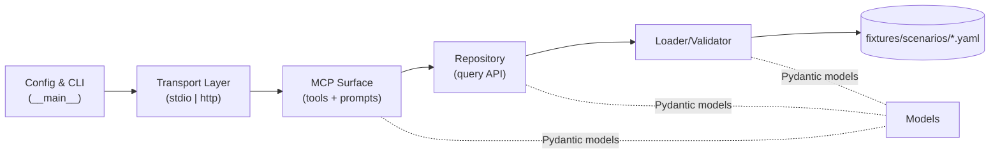

# Components

## Transport Layer

**Responsibility:** Start the server in the selected mode and bridge MCP messages to the surface handlers.

**Key Interfaces:**
- `run_stdio()` — offline student mode
- `run_http(host, port)` — instructor-hosted streamable HTTP mode

**Dependencies:** MCP Surface, Config

**Technology Stack:** FastMCP transports; Uvicorn for HTTP.

## MCP Surface (Tools & Prompts)

**Responsibility:** Declare and handle MCP tools and prompts; validate inputs; translate repository results into tool outputs with clear schemas/descriptions.

**Key Interfaces:**
- Ticket tools: `get_ticket`, `list_tickets`, `search_tickets`
- Resource tool: `get_ticket_resources`
- Telemetry tools: `query_arm_traces`, `query_network_logs`, `query_compute_host_logs`, `query_compute_guest_logs`
- KB tool (Epic 5): `search_known_issues` (generic remediation; own module `tools/kb.py`)
- Health tool: `get_server_info`
- Prompts: triage/scoping, follow-up questioning, iterative investigation, RCA

**Dependencies:** Repository, Models

**Technology Stack:** FastMCP decorators; Pydantic models for I/O.

## Repository (In-Memory Data Access)

**Responsibility:** Provide deterministic query methods over the loaded, immutable in-memory indices (by ticket id, search index, resource-by-ticket, telemetry-by-(table, resource)).

**Key Interfaces:**
- `get_ticket(id)`, `search_tickets(filters, page)`, `list_tickets(page)`
- `get_resources(ticket_id)`, `get_resource(resource_id)`
- `query_telemetry(table, resource_id, time_range, filters, instance_id?)`
- `search_known_issues(query?, product?, category?)` (Epic 5; over the loaded KB list)

**Dependencies:** Loader (data), Models

**Technology Stack:** Pure Python; dict/list indices built once at startup.

## Fixture Loader & Validator

**Responsibility:** Discover, parse, and validate all scenario YAML files at startup; build indices; fail fast with precise errors on any schema violation or cross-reference inconsistency.

**Key Interfaces:**
- `load_scenarios(path) -> Dataset`
- `validate(dataset)` — schema + referential + evidence-consistency checks

**Dependencies:** Models, fixtures on disk

**Technology Stack:** PyYAML + Pydantic.

## Config & CLI

**Responsibility:** Parse CLI/env config (transport, host, port, fixtures path), apply defaults, and surface clear errors for invalid config.

**Key Interfaces:** `__main__.py` entry point; `Settings` model.

**Dependencies:** Transport Layer.

**Technology Stack:** argparse (or Typer) + Pydantic settings.

## Component Diagram

