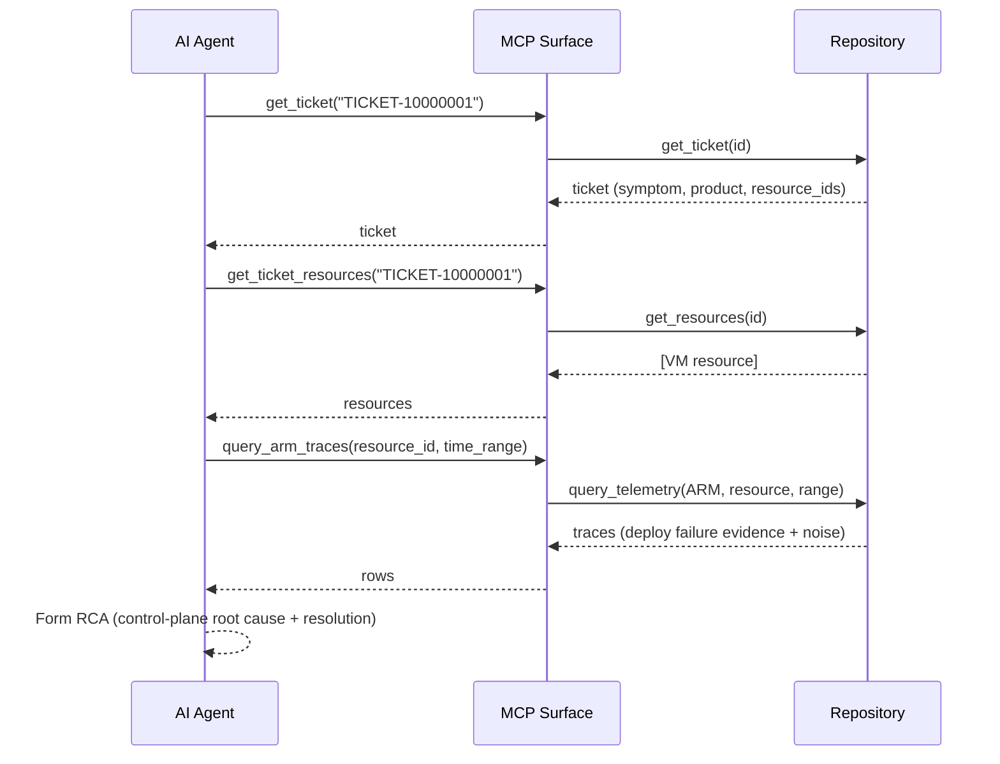

# Core Workflows

## Single-round RCA (e.g., ARM control-plane failure)



## Multi-round RCA (evidence distributed across tables)

```mermaid
sequenceDiagram
    participant A as AI Agent
    participant M as MCP Surface
    participant R as Repository
    A->>M: get_ticket + get_ticket_resources
    M-->>A: VMSS resource (instances)
    A->>M: query_compute_host_logs(resource, range)
    M-->>A: host logs (inconclusive: healthy host)
    A-->>A: Hypothesis: issue is in-guest, not host
    A->>M: query_compute_guest_logs(resource, instance_id, range)
    M-->>A: guest Windows events (service crash evidence)
    A-->>A: Refine RCA; confirm via narrowed query if needed
```
