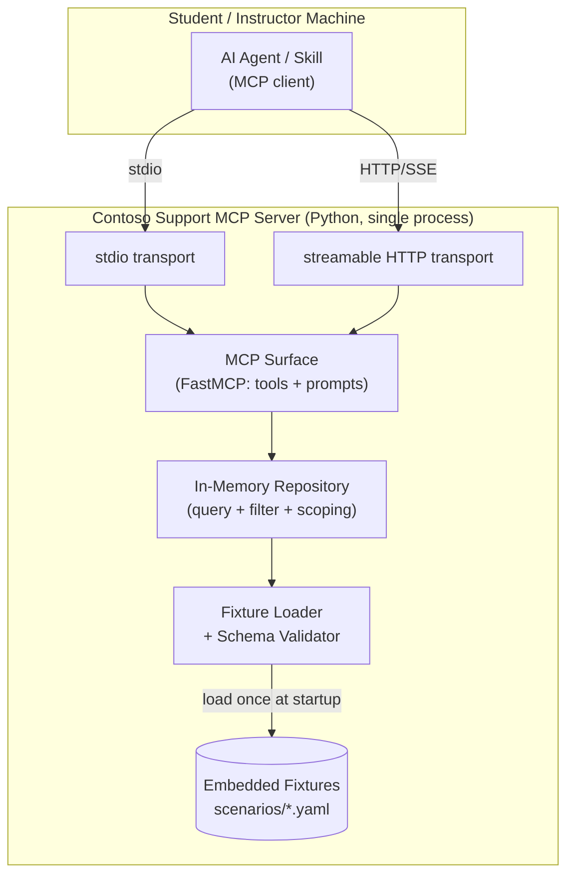

# High Level Architecture

## Technical Summary

The Contoso Support Ticketing MCP Server is a **single-process, stateless Python monolith** exposing MCP **tools** and **prompts** over two interchangeable transports (**stdio** for offline student hosting, **streamable HTTP** for instructor hosting). It is built on the official Python MCP SDK (FastMCP) and reads a fully-embedded, deterministic mock dataset — support tickets and correlated Kusto-style telemetry — loaded from bundled fixture files into in-memory indices at startup. A clean seam separates the **MCP surface** (tool/prompt handlers) from the **mock data layer** (Pydantic models, a fixture loader/validator, and an in-memory repository with query logic). This directly supports the PRD goals: realistic Azure support-engineering scenarios, deterministic and repeatable responses for gradeable labs, zero external dependencies, and a scenario library that scales to 100+ without code changes.

## High Level Overview

1. **Architectural style:** Modular monolith — one Python process, internally layered (transport → MCP surface → service/repository → data fixtures). Chosen for simplicity, offline determinism, and easy classroom distribution (PRD: Monolith).
2. **Repository structure:** **Monorepo** (PRD) — server code, fixtures, prompts, tests, and docs in one distributable unit.
3. **Service architecture:** Single stateless service; responses are a pure function of (loaded fixtures + tool inputs), which is what guarantees determinism.
4. **Primary data flow:** A student's agent → (via MCP tool call) → MCP surface handler → repository query over in-memory indices → structured result. The canonical journey: read a ticket → pivot to its resource → query correlated Kusto telemetry → (iterate for multi-round scenarios) → produce an RCA.
5. **Key decisions & rationale:**
   - **FastMCP (Python MCP SDK)** gives both stdio and streamable HTTP from one implementation — satisfies the dual-transport requirement without a second codebase.
   - **In-memory, fixture-backed data** (no database) keeps the server offline, fast (<1s), and trivially concurrency-safe for classroom-scale reads.
   - **One YAML file per scenario** keeps scenarios self-contained, human-authorable, and addable without touching server code (PRD NFR9).
   - **Determinism by construction:** no randomness or wall-clock dependence at query time; any "realistic noise" is authored into fixtures.

## High Level Project Diagram

## Architectural and Design Patterns

- **Modular Monolith:** One process, layered internally (transport / MCP surface / service / data). - _Rationale:_ Matches PRD's monolith decision; simplest thing that satisfies offline determinism and classroom distribution.
- **Repository Pattern:** The data layer exposes a repository API (`get_ticket`, `search_tickets`, `get_resources`, `query_telemetry`) abstracting the in-memory indices. - _Rationale:_ Keeps the MCP surface thin, makes the data layer independently testable, and isolates the fixture format from tool code.
- **Data Transfer Objects via Pydantic:** All entities and tool I/O are Pydantic models. - _Rationale:_ Free validation of fixtures on load and of tool inputs at the boundary; auto-generated JSON schemas for MCP tool descriptions.
- **Loader/Validator on Startup (fail-fast):** Fixtures are parsed and validated once at boot; malformed data aborts startup with a precise error. - _Rationale:_ Guarantees classroom reliability — bad data can never reach a student mid-lab.
- **Pure-Function Query Layer:** Queries are deterministic filters over immutable in-memory data. - _Rationale:_ Delivers the determinism guarantee (identical inputs → identical outputs) and inherent read concurrency safety.
- **Data-Driven Scenarios:** Behavior/content lives in fixtures, not code. - _Rationale:_ Scales to 100+ scenarios and multi-round evidence chains without server changes (PRD NFR9, FR9/FR10).
